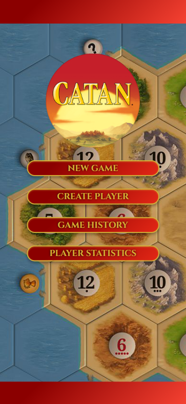
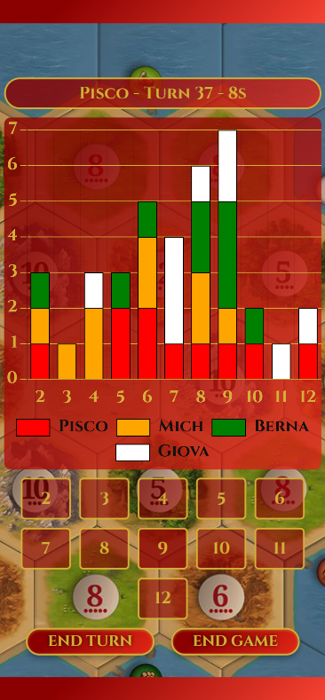
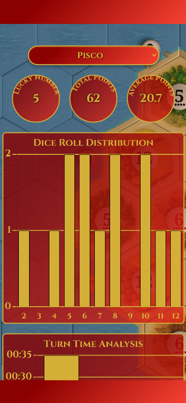

# Catan Dice Counter

Catan Dice Counter is a full-stack web application designed to enhance the Catan board game experience by tracking dice
rolls, turns, game durations, and player statistics. Built with Angular 19 for the frontend and Spring Boot 3.4.3 with
Java 23 for the backend, it uses SQLite for lightweight data persistence and provides a polished, thematic user
interface.

<div style="display: flex; justify-content: center; gap: 10px;">
  
  
  
</div>

## Features

- **Game Setup**: Create games with 2-5 players, assign unique colors, and set player order with drag-and-drop
  functionality.
- **Gameplay Tracking**: Record dice rolls and turn durations in real-time, with a stacked bar chart visualizing roll
  distributions.
- **End Game**: Assign ranks and points to players, with a victory modal featuring confetti effects.
- **History**: View past games, delete them, and access detailed game statistics with charts (roll distribution, roll
  sequence, time management).
- **Player Statistics**: Analyze individual player performance across all games, including total points, average points,
  lucky number, roll distribution, and turn time analysis.
- **Error Handling**: User-friendly modals for errors, such as attempting to end a turn without selecting a dice number.
- **Thematic Design**: Consistent use of the `Cinzel` font, gold (`#d4af37`) accents, and a red gradient theme inspired
  by Catan.

## Tech Stack

### Frontend

- **Framework**: Angular 19
- **Libraries**: Chart.js (visualizations), Angular CDK (drag-drop), Canvas Confetti (effects)
- **Styling**: Custom CSS with a Catan-inspired theme
- **Build Tool**: Angular CLI

### Backend

- **Framework**: Spring Boot 3.4.3 with Java 23
- **Database**: SQLite with HikariCP connection pooling
- **ORM**: JPA/Hibernate with SQLite dialect
- **Schema Management**: Liquibase
- **DTO Mapping**: MapStruct
- **Logging**: SLF4J

### Deployment

- **Containerization**: Docker with a multi-stage build
- **Hosting**: Deployed on Railway (or adaptable to other platforms)

## Prerequisites

- **Node.js**: v20.11.0 or later
- **npm**: v10.2.4 or later
- **Java**: JDK 23
- **Maven**: 3.9.6 (included in Docker build)
- **Docker**: Optional, for containerized deployment

## Setup Instructions

### Local Development

1. **Clone the Repository**:
   ```bash
   git clone <repository-url>
   cd catan-dice-counter
   ```
2. **Fronted Setup**
    ```bash
    cd frontend
    npm install
    ng serve   
    ```

## Docker deployment
```bash
docker build -t catan-dice-counter .
docker run -p 8080:8080 -v $(pwd)/data:/app/data catan-dice-counter
```
## Environmental variables
* **PORT**: Override default port (8080).
* **DATASOURCE_URL**: Custom SQLite path (e.g., jdbc:sqlite:/custom/path/database.db).

